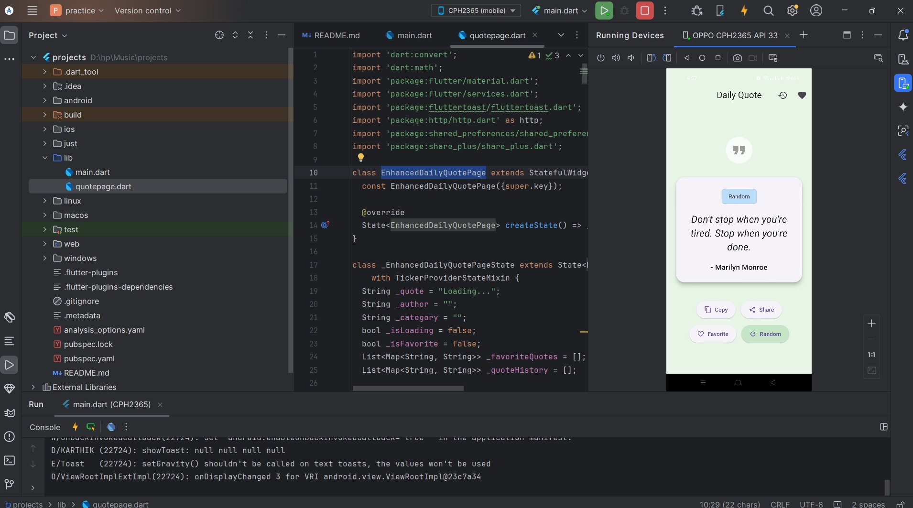
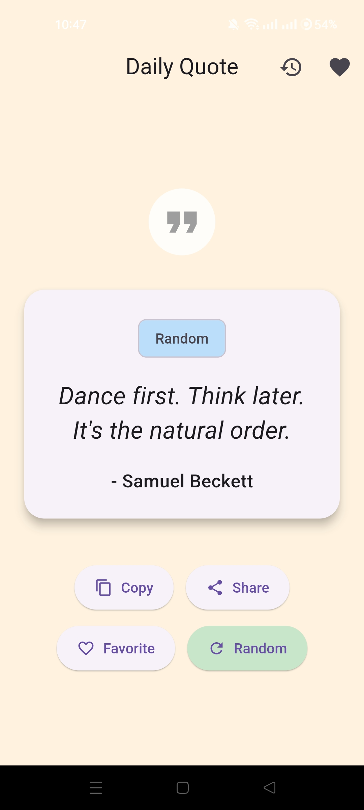
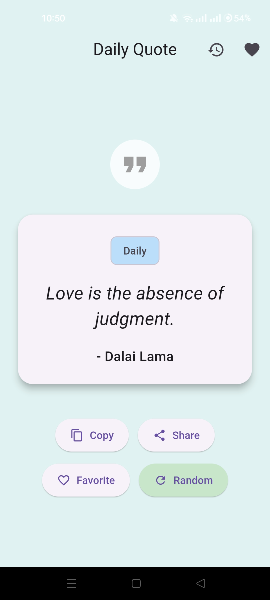
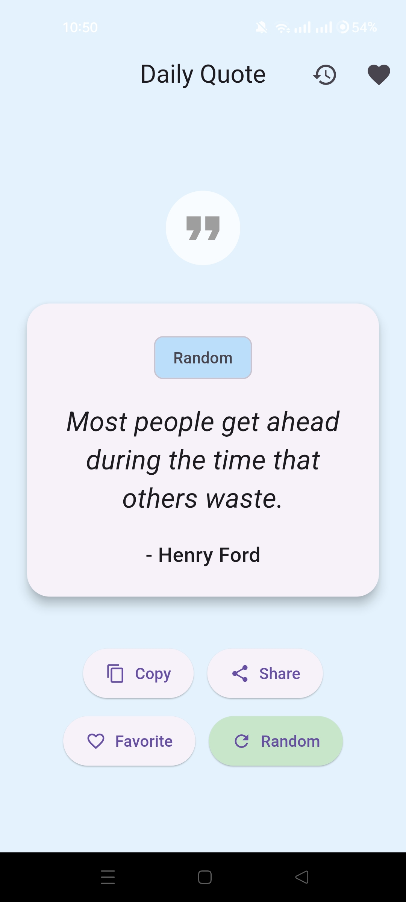
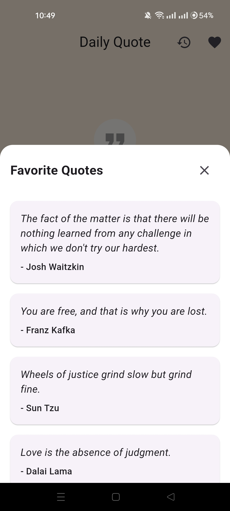

# 💬 Flutter Quote App

[](https://flutter.dev)
[](https://dart.dev)
[]()
[](https://opensource.org/)

## 📘 Overview

**Flutter Quote App** is a compact and user-friendly mobile application built using **Flutter** and **Dart**, ideal for beginners who want to practice app development and learn core Flutter concepts.

This app displays **random quotes**, allowing users to generate a new inspirational quote with each tap. Users can also **copy quotes**, **share them on social media**, and **save their favorites** for later access.

---

## 🎬 Intro

<div align="center">
  
  
    
</div>


## ✨ Features

* 💡 **Random Quote Generator** — Get a fresh quote every time you tap the button.
* ❤️ **Favorites** — Save your favorite quotes for quick access later.
* 📤 **Share Feature** — Easily share quotes with friends on social media or messaging apps.
* 📋 **Copy to Clipboard** — Copy any quote with a single tap.
* 🎨 **Minimal & Elegant UI** — Simple design for an intuitive experience.

---

## 🏗️ Tech Stack

| Technology              | Description                                            |
| ----------------------- | ------------------------------------------------------ |
| **Flutter**             | Cross-platform UI toolkit for building apps            |
| **Dart**                | Language used to build the Flutter app                 |

---

## 📸 Screenshots

<div align="left">
  <table>
    <tr>
      <td></td>
      <td></td>
      <td></td>
      <td></td>
    </tr>
  </table>
</div>

---

## 🎥 Demo Video

Watch the **Quiz App** in action on **X :**
👉 [Watch the Demo Here](https://x.com/KishanP07684084/status/1937500166665142450)

---


## 🏗️ Tech Stack

| Technology              | Description                                             |
| ----------------------- | ------------------------------------------------------- |
| **Flutter**             | Cross-platform framework for building native interfaces |
| **Dart**                | Programming language used to develop Flutter apps       |

---

## ⚙️ Installation & Setup

Follow these simple steps to set up and run the project locally:

### 1️⃣ Clone the Repository

```bash
git clone https://github.com/<your-username>/Flutter-Quiz-App.git
cd Flutter-Quiz-App
```

### 2️⃣ Install Dependencies

```bash
flutter pub get
```

### 3️⃣ Run the Application

```bash
flutter run
```

---


## 🧩 Learning Outcomes

By working on this project, beginners will learn:

* How to manage **state** and handle **user actions**.
* Using **Flutter widgets** to build responsive and dynamic UIs.
* Implementing **sharing**, **copying**, and **favorites** features.
* Structuring a simple yet functional Flutter project.

---

## 🤝 Contributing

Contributions are welcome! If you’d like to enhance the app:

1. Fork the repository.
2. Create a new branch (`git checkout -b feature-name`).
3. Commit your changes (`git commit -m 'Add new feature'`).
4. Push to your branch (`git push origin feature-name`).
5. Open a Pull Request 🚀

---

🧠 Flutter Development Environment Setup

This project is built using Flutter. Below are the essential details and configuration requirements for replicating the development environment.

| Component              | Details                                      |
| ---------------------- | -------------------------------------------- |
| **Flutter Version**    | 3.27.1 (Stable Channel)                      |
| **Framework Revision** | 17025dd882                                   |
| **Engine Revision**    | cb4b5fff73                                   |
| **Dart Version**       | 3.6.0                                        |
| **DevTools Version**   | 2.40.2                                       |
| **Operating System**   | Windows 10 (Version 10.0.26200.6725, 64-bit) |
| **Locale**             | en-US                                        |


💻 Android Studio

* Version: 2023.3
* Java Runtime: OpenJDK 17 (17.0.10+0--11572160)

  
## 🪪 License

This project is licensed under the **MIT License** — see the [LICENSE](LICENSE) file for details.

---

## 💬 Connect

For questions, suggestions, or collaborations:

📧 **[My Email](coolmax17787@gmail.com)**
🐦 **[Follow me on X (Twitter)](https://x.com/KishanP07684084)**
💼 **[LinkedIn](https://www.linkedin.com/in/hom-bdr-pathak-01a3bb210)**

---

> 🌟 *If this project inspired you or helped your Flutter learning journey, give it a star and share it with others!*


